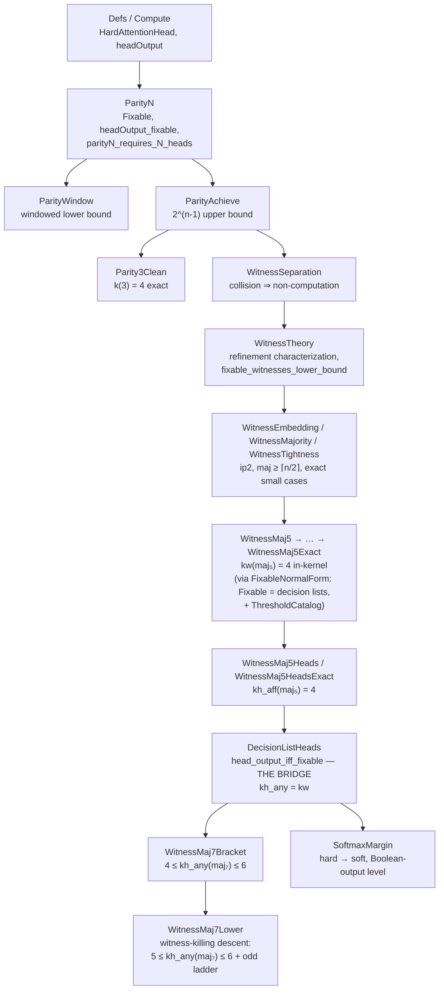

# attention-lean

[](https://lean-lang.org/)
[](https://github.com/leanprover-community/mathlib4)
[](AttentionLean)
[](https://doi.org/10.5281/zenodo.21188380)
[](LICENSE)

Lean 4 / Mathlib formalisation of hard attention expressivity over finite Boolean sequences: how many attention heads it takes to compute a Boolean function, proved to the kernel.

## Headline results

**The main theorem is general.** For *every* odd `n ≥ 5`, strict majority on `n` bits needs strictly more attention heads than its certificate complexity suggests:

> **`k(majₙ) ≥ (n+3)/2`  for all odd `n ≥ 5`**  (`maj_odd_ladder`) — one above the certificate bound `⌈n/2⌉` across the entire infinite odd-majority family, machine-checked to the kernel with no enumeration.

`maj₅` and `maj₇` are the first two rungs of that ladder; the rest of the library builds the machinery that makes the general bound possible:

- **A single hard-attention head is exactly a decision list** (`head_output_iff_fixable`). This hinge turns head-count lower bounds into clean combinatorial witness-count bounds.
- **`k(maj₅) = 4`, exactly** (`maj5_head_number_exact`, fully in-kernel, no exhaustive search): the first rung, and the first *proven* gap of its kind — it refutes the tempting identity `k(T) = minCert(T)`.
- **`k(maj₇) ∈ [5, 6]`** (`maj7_witness_bracket_tight`): the second rung, tightened from `[4, 6]` by the same witness-killing descent, with **no enumeration over the 128-point cube**.
- **The ladder itself** (`maj_odd_ladder`): the descent iterates, lifting the gap from two special cases to the whole odd family. This is the general theorem above.
- **The idealisation is not a cheat.** The theory survives hard → soft: at large `β`, softmax over a decision list's score tables gives the same Boolean output (`softmax_margin_realizes_dl`).

Every structural result is kernel-checked on `{propext, Classical.choice, Quot.sound}` — no `sorry`, no `native_decide`. Enumerated cases (isolated) are the only `native_decide` users and are pinned separately.

## Why `Fixable` matters (the one idea)

If you read nothing else, read this. A single hard-attention head, whatever its internal dimension, does one thing: it picks a position by argmax and reads that position through a thresholded affine map. The exact class of Boolean functions a head can produce this way is captured by a single property, `Fixable`: `f` is `Fixable` when, on **any** subcube, there is some one coordinate you can pin (to some value) that makes `f` constant on the pinned slice (`Fixable` in `ParityN.lean`). Equivalently (`fixable_iff_dl`), the `Fixable` functions are exactly the **decision lists** ("if `x₃` then 1, else if `x₇` then 0, else ..."). So a single hard-attention head *is* a decision list, no more and no less (`head_output_iff_fixable`).

That one equivalence is the hinge of the whole library. It converts a question about neural-network geometry ("how many attention heads compute `f`?") into a clean combinatorial one ("how many decision lists must you combine to get `f`?"), which is what every lower bound below actually attacks. A head cannot compute `f` alone exactly when no single coordinate ever pins `f` constant; several heads fail together exactly when their pinned slices "collide" on a pair that `f` separates. Hold onto `Fixable` = decision list, and the rest is bookkeeping over that idea.

## The story: what this library proves

Read top to bottom, the library is one argument that grows in generality. Each rung is machine-checked; the honest scope of each is stated where it lands.

**1. One head is weak.** A single hard-attention head computes Boolean `AND` and `OR` (`and_one_head`, `or_one_head`), but no single head of any internal dimension computes `XOR` (`xor_not_single_head`). The first separation: attention heads are not universal one at a time.

**2. Parity is the yardstick, and "n heads suffice" is false.** Write `k(n)` for the least number of heads computing `parityN`. Two clean-axiom theorems bracket it: fewer than `n` heads never compute `parityN` (`parityN_requires_N_heads`, structural, no `native_decide`), and `2^(n-1)` heads always do (`parityN_achievable_with_exp_heads`, one indicator head per odd point). So `n ≤ k(n) ≤ 2^(n-1)`. At `n = 2` the ends meet (`k(2) = 2`). At `n = 3` we close the gap exactly and structurally: `k(3) = 4 = 2^(3-1)` (`parity3_head_complexity_four`) — three heads provably cannot, four can. The lower bound is not "n heads are enough"; the exponential upper bound is the real ceiling.

**3. A second, orthogonal way to fail.** Heads whose argmax stays inside windows that jointly miss a coordinate cannot compute `parityN`, with **no bound on how many heads** you use (`parityN_requires_window_union`). This is incomparable to the counting bound: `n` heads all windowed on one position still fail.

**4. The abstraction: witness separation.** Steps 2–3 are instances of one domain-agnostic principle (`WitnessSeparation`, `WitnessTheory`). Model any computation as a family of *witnesses* `w : Fin k → S → V` read by an arbitrary *aggregator* `agg`. Then:
- **Collision ⇒ non-computation** (`witness_separation_fails`, on `Quot.sound` alone): if two states collide under every witness while the target separates them, no aggregator computes the target.
- **Exact characterization** (`witness_computable_iff_refines`): some aggregator works *iff* the witnesses refine the target. The kernel is its one-pair contrapositive.
- **Two independent lower bounds**: information-capacity (`witness_counting_bound`, `|A| ≤ |V|^k`) and sensitivity (`fixable_witnesses_lower_bound`).
- The parity bound falls out verbatim (`parityN_requires_N_heads_of_witness_theory`), now for **any** aggregator, not just a threshold. The same kernel even fires outside attention, on monotone potentials over a preorder (`potential_separation_fails`, the Lyapunov reading).

**5. Majority is the hard case, and it breaks the easy conjecture.** Strict majority needs at least `⌈n/2⌉` fixable witnesses (`maj_needs_half_fixable_witnesses`). Exact witness numbers land for the small cases: `k(maj₃) = 2`, `k(parity_n) = n`, `k(ip2) = m`. Then the first genuine gap: `maj₅`. Its witness number is exactly **4** (`maj5_witness_number_exact`, fully in the kernel — no exhaustive search), while its certificate complexity is 3. So the tempting identity `k(T) = minCert(T)` is **false**, and `maj₅` is where it first fails.

**6. The bridge back to real attention.** All of the above is stated over abstract "fixable witnesses." The bridge theorem `head_output_iff_fixable` closes the loop: a Boolean function is a hard-attention head output **iff** it is `Fixable` **iff** it is a decision list. Consequently `heads_computability_iff_fixable_witnesses` — head-count questions and witness-count questions are the same question. The abstract results become attention theorems: `maj5_requires_four_heads`, and exactly `k_heads(maj₅) = 4` (`maj5_head_number_exact`). The `maj₇` ladder is bracketed the same way: `4 ≤ k ≤ 6`, both as witnesses (`maj7_witness_bracket`) and as heads (`maj7_head_bracket`), with six explicit fixable witnesses and an aggregator that reconstruct majority on all 128 points. The bracket then **tightens to `5 ≤ k ≤ 6`** (`maj7_witness_bracket_tight`, `maj7_head_bracket_tight`) by a witness-killing descent (`maj_witness_descent`, `WitnessMaj7Lower`): a fixable witness is constant on some half-cube; pinning that half-cube plus one opposite-valued coordinate is a *balanced* double pin, under which maj₇ restricts to maj₅ and the constant witness dies — so four witnesses for maj₇ would give three for maj₅, contradicting the in-kernel `maj5_no_three_fixable_witnesses`. No enumeration over the 7-cube. The descent iterates (`maj_odd_ladder`): `k(maj_n) ≥ (n+3)/2` for every odd `n ≥ 5`, one better than the certificate bound everywhere on the odd ladder.

**7. The idealisation is not a cheat: hard → soft.** Every result above is for *hard* attention (argmax). Real transformers use *softmax*. The final rung shows the theory survives the switch: at large enough inverse temperature `β`, softmax over a decision list's own score tables produces the **same Boolean output** as the hard decision list, on every input (`softmax_margin_realizes_dl`). Honest scope, stated in the module and load-bearing: this is threshold / sign agreement under a strictly positive score margin (`γ = 1`, from the integer priority scores), **not** exact equality of the soft value with the hard read — that is false at finite `β`, since softmax always puts mass everywhere. The expressivity story is about Boolean outputs, and at that level it transfers to soft attention.

Net: the exact head counts now proven to the kernel are `k(parity_n) = n` lower with `2^(n-1)` upper (`k(3) = 4` exact), `k_heads(maj₃-witnesses) = 2`, `k_heads(maj₅) = 4` (strictly above its certificate complexity 3), the `maj₇` bracket `[5, 6]`, and the equivalence of hard-attention heads, fixable witnesses, and decision lists — carried across to softmax at the Boolean-output level.

## Notation: three head-counting quantities

The library proves bounds on three related but distinct quantities, and keeping them apart is load-bearing. Every theorem in this README is about one of these:

| Symbol | Quantity | Combining rule |
|---|---|---|
| `kw(T)` | **Fixable-witness number** — least `k` such that some `k` `Fixable` witnesses and some aggregator compute `T` | arbitrary Boolean aggregator `agg : (Fin k → Bool) → Bool` |
| `kh_any(T)` | **Head number, arbitrary readout** — least `k` such that some `k` hard-attention heads and some Boolean aggregator over their outputs compute `T` | arbitrary Boolean aggregator |
| `kh_aff(T)` | **Head number, affine readout** — least `k` such that some `k` hard-attention heads through a thresholded affine readout (`∑ wᵢ·vᵢ + bias > 0`) compute `T` | thresholded affine only |

Relations:

- `kh_any(T) = kw(T)` for every `T` (`heads_computability_iff_fixable_witnesses`, via the bridge theorem `head_output_iff_fixable`).
- `kh_any(T) ≤ kh_aff(T)` — an affine readout is one particular aggregator. So arbitrary-aggregator **lower** bounds are the strong ones, and affine-readout **upper** bounds are the strong ones.
- Transfer caveat: a `kw` upper bound yields a `kh_aff` upper bound only when the witness-side aggregator is itself threshold-affine (see the Appendix).

Which theorem is about which:

| Theorem | Quantity | Statement |
|---|---|---|
| `parityN_requires_N_heads` | `kh_aff` lower | `n ≤ kh_aff(parity_n)` |
| `parityN_requires_N_heads_of_witness_theory` | `kw` (= `kh_any`) lower | `n ≤ kw(parity_n)` — any aggregator, strictly stronger |
| `parityN_achievable_with_exp_heads` | `kh_aff` upper | `kh_aff(parity_n) ≤ 2^(n-1)` |
| `parity3_head_complexity_four` | `kh_aff` exact | `kh_aff(parity₃) = 4` |
| `maj5_witness_number_exact` | `kw` (= `kh_any`) exact | `kw(maj₅) = 4` |
| `maj5_head_number_exact` | `kh_aff` exact | `kh_aff(maj₅) = 4` |
| `maj7_witness_bracket`, `maj7_head_bracket` | `kw` = `kh_any` bracket | `4 ≤ kh_any(maj₇) ≤ 6` — the upper end uses an arbitrary Boolean aggregator; **no `kh_aff` upper bound for `maj₇` is proven here** |
| `maj7_witness_bracket_tight`, `maj7_head_bracket_tight` | `kw` = `kh_any` bracket | `5 ≤ kh_any(maj₇) ≤ 6` — lower end raised by the witness-killing descent (`maj_witness_descent`); exact value in {5, 6} open |
| `maj_odd_ladder` | `kw` (= `kh_any`) lower | `kw(maj_n) ≥ (n+3)/2` for odd `n ≥ 5` (stated as: no `j+3` fixable witnesses compute maj on `2j+5` bits) |
| `softmax_margin_realizes_dl` | none of the three (single head, positive direction only) | a softmax head at large `β` reproduces a decision list's Boolean output |

## What this library does and does not prove

**Safe to claim** (each machine-checked, in the model formalized here):

- In a **single layer of hard (argmax) attention with position-local scores, deterministic smallest-index tie-breaking, and Boolean per-head outputs** over the Boolean cube: computing parity on `n` bits requires at least `n` heads, `2^(n-1)` heads suffice, and at `n = 3` the exact count is 4.
- The fixable-witness number of `maj₅` is exactly 4 while its certificate complexity is 3 — the first formal separation of the two.
- Single-head expressivity in this model is **exactly** the decision-list class (`head_output_iff_fixable`).
- At large inverse temperature `β`, a softmax head over a decision list's own score tables produces the same Boolean output as the hard head (`softmax_margin_realizes_dl`).

**Not claimed, and not implied — do not say:**

- ~~"This proves transformers need 4 heads for majority."~~ Every bound is exact **for this narrow model only**: single layer, hard attention, position-local scores, deterministic tie-break, Boolean outputs, Boolean-cube inputs. Nothing here is about trained transformers, multiple layers, real-valued value vectors, or learned parameters.
- ~~"Soft attention has the same expressivity."~~ The softmax section is a **positive realization under a margin** (threshold agreement at the `γ = 1` integer-score margin, for large enough finite `β`) — not a soft-attention lower bound, and not equality of the soft value with the hard read (false at every finite `β`).
- Any statement that mixes the three quantities above. Example: the `maj₇` bracket `[5, 6]` is a `kw`/`kh_any` statement; the library proves no affine-readout upper bound for `maj₇`.

## Axiom discipline

The general parity lower bound `parityN_requires_N_heads` (with `collision_exists_n` and the `parityN` compatibility lemmas), the windowed lower bound (`ParityWindow`), the general achievability upper bound (`ParityAchieve`), the whole witness-theory tower, the `maj₅`/`maj₇` results, the bridge theorem, and the softmax bridge are all proved using only the standard axioms `propext`, `Classical.choice`, `Quot.sound`, with no `native_decide`. Every headline theorem's axiom footprint is pinned by `#guard_msgs` in `AttentionLean/Axioms.lean`, and the `axiom_check` target is in the lake `defaultTargets`, so any axiom drift fails a bare `lake build`. The only exceptions, isolated by design, are the enumerated fixed-width lower bounds (the `Parity4*` modules and some `Compute` lemmas), which use `native_decide` and therefore additionally carry `Lean.ofReduceBool`; those are pinned separately in `AttentionLean/AxiomsDirty.lean`.

**Head complexity of parity, in one line.** Writing `k(n)` for the least number of heads computing `parityN`: `n ≤ k(n) ≤ 2^(n-1)`, both ends formal (`parityN_requires_N_heads`, `parityN_achievable_with_exp_heads`). At `n = 2` the bounds meet: `k(2) = 2` exactly. `k(3) = 4 = 2^(3-1)` exactly, fully machine-checked at the clean-axiom tier (`parity3_head_complexity_four`): three heads cannot compute parity3 (`parity3_not_achievable_with_three_heads`, a STRUCTURAL proof, no enumeration), and four heads do (`parity3_achievable_with_four_heads`). The exhaustive search (`scripts/parity_head_search.py`, 0 of 152,096 three-head multisets) stands as independent cross-evidence.

## Witness separation: a general lower-bound principle

The parity lower bound is one instance of a domain-agnostic principle formalised in `WitnessSeparation` and `WitnessTheory`. Model a computation as a family of *witnesses* `w : Fin k → S → V` read by an arbitrary *aggregator* `agg : (Fin k → V) → B`, computing `fun s => agg (fun i => w i s)`.

- **Refutation kernel** (`witness_separation_fails`, on `Quot.sound` alone): if two states collide under every witness while the target separates them, no aggregator computes the target. Collision implies non-computation.
- **Exact characterization** (`witness_computable_iff_refines`): some aggregator computes the target *iff* the witness map refines it (the target is constant on witness-fibres). The kernel is its one-pair contrapositive.
- **Two orthogonal lower bounds.** Information-capacity (`witness_counting_bound`: `|A| ≤ |V|^k` for high-image targets) and sensitivity (`fixable_witnesses_lower_bound`: an everywhere-sensitive target on `n` coordinates needs `n` `Fixable` witnesses, under *any* aggregator, not just a threshold).
- **Parity is a corollary.** `parityN_requires_N_heads` is recovered verbatim from the sensitivity bound (`parityN_requires_N_heads_of_witness_theory`): a hard-attention head is a `Fixable` witness, `parityN` is everywhere-sensitive, the thresholded readout is one aggregator.

The same kernel instantiates outside attention: `potential_separation_fails` shows a family of monotone potentials over a preorder cannot certify a predicate separating two order-equivalent states (the descent / Lyapunov reading).

## Theorems proved

| Module | Theorem | Description |
|---|---|---|
| `AttentionLean.Defs` | `attentionScore_eq_scoreVal` | The attention score at position `i` is exactly the position-local score value for `x i`. |
| `AttentionLean.Compute` | `argmaxScore_two` | For two positions, deterministic argmax selects position `0` when score `0 >= score 1`, otherwise position `1`. |
| `AttentionLean.Compute` | `headOutput_two` | Unfolds the full two-token hard-attention output into argmax, value read, affine readout, and threshold. |
| `AttentionLean.Compute` | `fin2_bool_forall` | Reduces universal claims about `Fin 2 -> Bool` inputs to the four Boolean cases. |
| `AttentionLean.AndOr` | `and_one_head` | Constructs a single one-dimensional hard-attention head computing Boolean AND on two-bit inputs. |
| `AttentionLean.AndOr` | `or_one_head` | Constructs a single one-dimensional hard-attention head computing Boolean OR on two-bit inputs. |
| `AttentionLean.Xor` | `xor_not_single_head` | Proves no single hard-attention head of any internal dimension computes XOR on two-bit inputs. |
| `AttentionLean.ParityN` | `parityN_requires_N_heads` | **General lower bound (headline).** For every `n` and every `k < n`, no `k` hard-attention heads through a thresholded affine readout compute `parityN`. Axioms: `propext`, `Classical.choice`, `Quot.sound`, with no `native_decide`. |
| `AttentionLean.ParityN` | `collision_exists_n` | Fewer than `n` fixable head-functions admit an opposite-parity input pair on which all of them agree: the pigeonhole / subcube collision that drives the general bound. |
| `AttentionLean.ParityWindow` | `parityN_requires_window_union` | **Windowed lower bound.** Heads whose argmax provably stays inside windows `W i` cannot compute `parityN` when the windows jointly miss a coordinate (`card (⋃ i, W i) < n`) — with no bound on the number of heads. Incomparable to `parityN_requires_N_heads` (e.g. `n` heads all windowed on one position). Same axioms, no `native_decide`. |
| `AttentionLean.ParityWindow` | `parityN_requires_window_bound` | Corollary of the union bound: `k` heads of window ≤ `t` need `k·t ≥ n`. (This numeric form also follows from `parityN_requires_N_heads`, since `t ≥ 1` forces `k ≤ k·t < n`; it is kept as the readable "heads × window" reading.) |
| `AttentionLean.ParityWindow` | `collision_of_fixableK` | t-coordinate generalisation of the collision lemma: `k` functions, each constant after pinning ≤ `t` coordinates on any subcube (`FixableK`), admit an opposite-parity agreeing pair whenever `k·t` is below the free-coordinate count. `Fixable` embeds at `t = 1` (`fixable_fixableK`). |
| `AttentionLean.ParityAchieve` | `parityN_achievable_with_exp_heads` | **General achievability (upper bound).** For every `n`, `2^(n-1)` hard-attention heads through a thresholded affine readout compute `parityN` — one indicator head per odd-parity point (`indicatorHead`, `indicatorHead_computes`, `card_odd_points`), unit weights, zero bias. The readout shape is verbatim the positive complement of `parityN_requires_N_heads`. Axioms: `propext`, `Classical.choice`, `Quot.sound`, no `native_decide`. |
| `AttentionLean.ParityAchieve` | `parity2_achievable_with_two_heads` | The `n = 2` instance: with the lower bound at `n = 2`, the exact head complexity of parity2 is 2. |
| `AttentionLean.Parity3Clean` | `parity3_not_achievable_with_three_heads` | **Clean-tier three-head insufficiency.** No 3-head configuration of any internal dimension computes parity3 — structural proof (fixability ⇒ half-cube constancy + face line-constancy; decidable face classification; three-case kill), no enumeration. Axioms: `propext`, `Classical.choice`, `Quot.sound`; no `native_decide`. |
| `AttentionLean.Parity3Clean` | `parity3_head_complexity_four` | **k(3) = 4 exactly**, both halves clean: the insufficiency above paired with `parity3_achievable_with_four_heads` (instance of the `2^(n-1)` construction at `n = 3`). |
| `AttentionLean.WitnessSeparation` | `witness_separation_fails` | **The collision ⇒ non-computation kernel** (axioms: `Quot.sound` alone): witnesses agreeing on two states a target separates admit NO aggregator computing the target. `Parity3Clean.kill3` routes through it; `parity3_indicator_heads_cannot_separate` reconstructs the antipode kill with concrete heads for EVERY aggregator; `potential_separation_fails` + `rank_potentials_cannot_see_flag` instantiate it for monotone potentials over a preorder. |
| `AttentionLean.WitnessTheory` | `witness_computable_iff_refines` | **Characterization**: some aggregator computes the target iff the witness map refines it (target constant on witness-fibres). The refutation kernel is its one-pair contrapositive. |
| `AttentionLean.WitnessTheory` | `witness_counting_bound` | **Information-capacity lower bound**: finite witness values + target injective on `A` ⇒ `|A| ≤ |V|^k`. Tight instance: identity on `Fin 4` — one Bool witness provably fails, two provably suffice. Scope: high-image targets only; does not subsume the parity bound. |
| `AttentionLean.WitnessTheory` | `fixable_witnesses_lower_bound` | **Sensitivity lower bound (the general theorem behind the parity bound)**: an everywhere-sensitive target on `n` Boolean coordinates is computed by no aggregator over `k < n` `Fixable` witnesses. `parityN_requires_N_heads` recovered verbatim as a corollary (`parityN_requires_N_heads_of_witness_theory`); strictly more general in the aggregator. |
| `AttentionLean.WitnessEmbedding` | `restriction_embedding_lower_bound` | **Embedding lower bound**: a target with a restriction that is everywhere-sensitive on `m` free coordinates is computed by no aggregator over `k < m` `Fixable` witnesses. Crux: fixability survives restriction (`fixable_restrict`). Instance: inner product mod 2 on `2m` bits — provably NOT everywhere-sensitive, yet embeds parity on the even coordinates, so it needs ≥ m fixable witnesses (`ip2_needs_m_fixable_witnesses`). Reach note: monotone targets (e.g. majority) are OUT. |
| `AttentionLean.WitnessMajority` | `maj_needs_half_fixable_witnesses` | **Majority settled HARD**: any aggregator over `k` fixable witnesses with `2k < n` fails against strict majority — `k(maj_n) ≥ ⌈n/2⌉` — via the subcube-nonconstancy bound `fixable_witnesses_lower_bound_of_nonconstant`. Upper bracket: `n` fixable dictators + `maj` as aggregator compute it (`maj_computable_by_n_fixable`); exact `k(maj)` in `[⌈n/2⌉, n]` open in general. |
| `AttentionLean.WitnessTightness` | `maj3_witness_number_exact` | **Tightness**: exact witness numbers — `k(maj₃) = 2` (construction `maj₃ = (x₀ ∨ (x₁∧x₂)) ∧ ¬(x₀ ∧ ¬x₁ ∧ ¬x₂)`), `k(parity_n) = n` (`parityN_witness_number_exact`), `k(ip2) = m` (`ip2_witness_number_exact`). General `k(T) = minCert(T)` open; `maj₅` (k ∈ {3,4}) is the smallest open case at this point. |
| `AttentionLean.WitnessMaj5` | `maj5_witness_bracket` | **k(maj₅) = 4 — the first gap, bracketed**: four fixable witnesses compute maj₅ (equality and all fixability by kernel `decide`), two provably fail. The k ≥ 4 half here is search evidence (`scripts/maj5_witness_search.py`, exact |Fixable(4)| = 1050 class); formalized in full in `WitnessMaj5Exact`. Machine-checked bracket 3 ≤ k ≤ 4. |
| `AttentionLean.WitnessMaj5Lower` | `maj5_reduction` | **The k(maj₅) ≥ 4 reduction, formalized**: any three fixable witnesses computing maj₅ have pairwise-distinct signed constancy directions (`maj5_shared_face_kill`, `maj5_W1W2_not_completable`) and unanimous signs when distinct (`maj5_mixed_signs_kill`). The structural spine of the in-kernel proof. |
| `AttentionLean.FixableNormalForm` | `fixable_iff_dl` | **The classification of fixable witnesses**: `Fixable` = decision lists, both directions. Kernel-verified oracle: `card_fixable3` — \|Fixable(3)\| = 96, the priority-function count. R4a of the k(maj₅) ≥ 4 program. |
| `AttentionLean.ThresholdCatalog` | `T2_refining_pair_classified` | **L1 — the threshold catalogs, classified in the kernel**: every ordered fixable pair refining T₂⁴ is one of the 24 catalog pairs, and dually for T₃⁴ (`T3_refining_pair_classified`). Soundness (`catalog_sound`/`catalog3_sound`) + in-kernel \|R2\| = \|R3\| = 24 oracles. The combinatorial engine behind the in-kernel `maj₅` proof. |
| `AttentionLean.WitnessMaj5Exact` | `maj5_witness_number_exact` | **k(maj₅) = 4, kernel-complete — the first gap is a theorem**: no three fixable witnesses compute maj₅ (`maj5_no_three_fixable_witnesses`), four do. Route: `maj5_reduction` → face classifications via the L1 catalogs (`face_classified`) → case-2 kill (third witness unfixable over all 2,880 parameters) and case-3 kill (canonical directions; per-witness decides; `case3_compat`). Retires the exhaustive-search dependency; subsumes the bracket. |
| `AttentionLean.WitnessMaj5Heads` | `maj5_requires_four_heads` | **maj₅ requires four hard-attention heads**: no 3 heads + thresholded affine readout compute strict majority on 5 bits — the attention face of k(maj₅) = 4, by instantiating `maj5_no_three_fixable_witnesses` with `headOutput_fixable` (no sensitivity argument applies: maj₅ is not everywhere-sensitive). Non-vacuity: three concrete indicator heads fail against EVERY aggregator. |
| `AttentionLean.WitnessMaj5HeadsExact` | `maj5_head_number_exact` | **k_heads(maj₅) = 4, exact**: four hard-attention heads + the linear-threshold readout `v₀+v₁+2v₂+2v₃ > 3/2` compute maj₅, and three cannot. Positive side (S1): each shipped witness `maj5W1..W4` is a five-literal decision list realized by a `tableHead` (indicatorHead pattern, dimension 2). |
| `AttentionLean.DecisionListHeads` | `head_output_iff_fixable` | **The bridge theorem**: a Boolean function is a hard-attention head output iff it is Fixable iff it is a decision list. Forward: general DL→head realization (`dl_realizable_by_head`, dimension 2 always suffices). Reverse: `headOutput_fixable`. Consequence: `heads_computability_iff_fixable_witnesses` — for arbitrary aggregators, k-head computability = k-witness computability. |
| `AttentionLean.WitnessMaj7Bracket` | `maj7_witness_bracket` | **maj₇ witness bracket `4 ≤ k ≤ 6`**: six explicit fixable witnesses (`maj7W0..W5`, two dictators + four five-bit blocks) plus a Boolean aggregator reconstruct strict majority on 7 bits — the equality is a kernel `decide` over all 128 cube points (`maj7_eq_six_witness_combination`) — and three fixable witnesses cannot (certificate lower rung `⌈7/2⌉ = 4`, from `maj_needs_half_fixable_witnesses`). Exact `k(maj₇)` in `[4, 6]` open. |
| `AttentionLean.WitnessMaj7Bracket` | `maj7_head_bracket` | **maj₇ head bracket `4 ≤ k ≤ 6`**: via `heads_computability_iff_fixable_witnesses`, six hard-attention heads with an arbitrary Boolean aggregator compute maj₇ and three do not. The attention face of the witness bracket. |
| `AttentionLean.WitnessMaj7Lower` | `maj_witness_descent` | **The witness-killing descent (the smarter lemma)**: `k+1` fixable witnesses computing maj on `n+2` bits yield `k` fixable witnesses computing maj on `n` bits — the first witness's constant half-cube plus one opposite-valued pin is a balanced double pin, so majority descends and the pinned witness dies (`fixable_restrict` keeps the rest fixable). Purely structural. |
| `AttentionLean.WitnessMaj7Lower` | `maj7_no_four_fixable_witnesses` | **k(maj₇) ≥ 5**: four fixable witnesses cannot compute strict majority on 7 bits — one descent step lands on the in-kernel `maj5_no_three_fixable_witnesses`. No enumeration over the 7-cube. |
| `AttentionLean.WitnessMaj7Lower` | `maj7_witness_bracket_tight` | **maj₇ witness bracket, tightened: `5 ≤ k ≤ 6`**. Six fixable witnesses suffice (frozen upper half), four cannot. Exact value in {5, 6} open. |
| `AttentionLean.WitnessMaj7Lower` | `maj7_head_bracket_tight` | **maj₇ head bracket, tightened: `5 ≤ k ≤ 6`** (arbitrary Boolean aggregator on both ends): `maj7_requires_five_heads` — no four hard-attention heads compute maj₇. |
| `AttentionLean.WitnessMaj7Lower` | `maj_odd_ladder` | **The odd-majority ladder**: for every `j`, no `j+3` fixable witnesses compute maj on `2j+5` bits — the descent iterated from the maj₅ base. Reads off `k(maj_n) ≥ (n+3)/2` for odd `n ≥ 5`, beating the certificate bound `⌈n/2⌉` by one everywhere on the ladder. |
| `AttentionLean.SoftmaxMargin` | `softmax_margin_realizes_dl` | **The hard → soft attention bridge**: for large enough inverse temperature `β` (`(card − 1) · exp(−β) < 1`), the thresholded *softmax* read over a decision list's own `pscore`/`pread` tables computes `P.eval` on every input — the soft-attention counterpart of the hard `priorityDL_realizable`. Backed by the abstract `softmax_margin_realizes_argmax_sign` (softmax realizes the argmax sign under a positive score margin `γ`). **Honest scope**: Boolean-output / sign agreement at finite `β` under the `γ = 1` integer-score margin, NOT exact equality of the soft value with the hard selected read (false at finite `β` — softmax always mixes). Finite `Real.exp` inequalities only; no limits, no `native_decide`. |
| `AttentionLean.Parity4Main` | `parity4_requires_four_heads` | Enumerated `n = 4` case: no 3 heads compute parity on 4 bits. Proved by `native_decide`, so it additionally carries `Lean.ofReduceBool`. |
| `AttentionLean.ParitySmall` | `parity3_requires_three_heads` | Enumerated `n = 3` case: no 2 heads compute parity on 3 bits. Proved by `native_decide`, so it additionally carries `Lean.ofReduceBool`. |

## Dependency graph

How the results feed each other (arrows = "is used by"; module imports follow the same order):



(The concrete import chain is currently linear through the `maj₅` modules — in particular `DecisionListHeads` sits downstream of `WitnessMaj5HeadsExact`, even though the bridge theorem is logically more general. A possible future refactor extracts the generic decision-list head realization below the `maj₅` construction; it would change imports only, no statements.)

## Module structure

```text
AttentionLean/
├── Defs.lean:          HardAttentionHead, scores, value reads, argmax, head output
├── Compute.lean:       Computes predicate and two-token helper theorems
├── AndOr.lean:         single-head constructions for AND and OR
├── Xor.lean:           single-head lower bound for XOR
├── ParityN.lean:       general parity lower bound (parityN_requires_N_heads, collision_exists_n)
├── ParityNCompat.lean: parityN compatibility / bridge lemmas
├── ParityWindow.lean:  t-fixable generalisation + windowed lower bound (parityN_requires_window_union)
├── ParityAchieve.lean: general achievability upper bound (parityN_achievable_with_exp_heads)
├── Parity3Clean.lean:  clean-tier 3-head insufficiency for parity3 (k(3) = 4 exact)
├── WitnessSeparation.lean: abstract collision ⇒ non-computation kernel + two instances
├── WitnessTheory.lean: computability characterization + counting & fixable lower bounds
├── WitnessEmbedding.lean: restriction/embedding lower bound + inner-product instance
├── WitnessMajority.lean: subcube-nonconstancy bound; majority needs ≥ ⌈n/2⌉ witnesses
├── WitnessTightness.lean: exact witness numbers (maj₃ = 2, parity = n, ip2 = m)
├── WitnessMaj5.lean:   k(maj₅) = 4 — witness number exceeds certificate complexity (bracket)
├── WitnessMaj5Lower.lean: structural reduction toward the k(maj₅) ≥ 4 formalization
├── FixableNormalForm.lean: Fixable = decision lists (R4a) + catalog-cascade openers
├── ThresholdCatalog.lean: L1 — the 24-pair threshold catalogs, kernel-classified
├── WitnessMaj5Exact.lean: k(maj₅) = 4 fully in the kernel (L2-L4 closed)
├── WitnessMaj5Heads.lean: maj₅ requires four hard-attention heads
├── WitnessMaj5HeadsExact.lean: four heads suffice — k_heads(maj₅) = 4 exact
├── DecisionListHeads.lean: bridge theorem — Fixable = decision lists = head outputs
├── WitnessMaj7Bracket.lean: maj₇ bracket 4 ≤ k ≤ 6 (witness and head forms)
├── WitnessMaj7Lower.lean: witness-killing descent — maj₇ bracket tightened to [5, 6] + odd ladder
├── SoftmaxMargin.lean: hard → soft bridge — softmax realizes decision lists at large β
├── Axioms.lean:        the build-gated axiom transcript (clean-tier theorems, #guard_msgs pinned)
├── AxiomsDirty.lean:   pinned footprints for the native_decide (enumerated) lower bounds
├── ParitySmall.lean:   enumerated n=3 lower bound (parity3_requires_three_heads)
└── Parity4*.lean:      enumerated n=4 lower bound (parity4_requires_four_heads) + achievability batches
AttentionLean.lean: root module re-exporting all submodules
```

## Building

```bash
lake build
```

A bare `lake build` also runs the `axiom_check` target, so any axiom drift (a `sorryAx` creep, a stray `native_decide` on a clean-tier theorem) fails the build itself.

## Verification

```bash
lake exe axiom_check                # pinned axiom footprint of every headline theorem
python3 scripts/check_no_sorry.py   # no `sorry` outside comments (comment-aware)
```

No proof uses `sorry` or `admit`. (A bare `rg "sorry|admit"` shows only prose hits in docstrings — "no sorry", "admit a restriction" — which is why the guard strips Lean comments before matching; it runs in CI.) See [REPRODUCING.md](REPRODUCING.md) for the full build-and-verify walkthrough with expected outputs and timings.

## Independent cross-checks (exhaustive search)

The Lean proofs stand on their own. As an *independent*, non-Lean confirmation of the sharpest counting claims, `scripts/` holds brute-force search programs in plain Python. They agree with the kernel and were the empirical scaffolding before the structural proofs replaced them.

- **`parity_head_search.py`** — enumerates all three-head multisets against `parity3`: **0 of 152,096** compute it, cross-checking the `k(3) = 4` lower bound (`parity3_not_achievable_with_three_heads`).
- **`maj5_witness_search.py`** — exhaustively searches the exact `|Fixable(4)| = 1050` class for three fixable witnesses computing `maj₅` and finds none, the empirical form of `maj5_no_three_fixable_witnesses`. The kernel proof in `WitnessMaj5Exact.lean` later retired this dependency; the script remains as an outside check.
- **`maj5_case_kill_oracle.py`** — generates and independently verifies the case-kill hitting lists / bad lists that the in-kernel `maj₅` cascade (`case2_dead`, `case3_dead`) consumes.

Because these searches share no code with the Lean development, agreement between the two is genuine cross-evidence rather than a restatement.

## License

MIT. See [LICENSE](LICENSE). Copyright (c) 2026 Ben Cassie.

## Appendix: the bridge theorem, in full

`head_output_iff_fixable` (`DecisionListHeads.lean`) closes the characterization of single-head expressivity: a Boolean function on n bits is the output of some hard-attention head **iff** it is `Fixable` **iff** (by `fixable_iff_dl`) it is a decision list. Consequently (`heads_computability_iff_fixable_witnesses`), for arbitrary aggregators, computability by k heads coincides with computability by k `Fixable` witnesses: every witness-number upper bound transfers to heads (dimension 2 suffices), and every head-count lower bound is provable in witness space. Caveat: with a thresholded affine readout on the head side, upper bounds transfer only when the witness-side aggregator is itself threshold-affine.

The softmax bridge (`SoftmaxMargin.lean`) extends the *positive* direction past hard attention: the same decision-list score tables that an argmax head realizes are also realized, at the Boolean-output level, by a softmax head at large `β`. So the exact head counts proved here — `parity_n = n` lower with `2^(n-1)` upper, `maj₃-witnesses = 2`, `maj₅ heads = witnesses = 4` (strictly above certificate complexity 3), and the `maj₇` bracket `[5, 6]` — describe the expressivity of the decision-list class that both hard and soft attention compute.

---

Part of the [velvetmonkey Lean 4 proof corpus](https://velvetmonkey.github.io/lean/).
